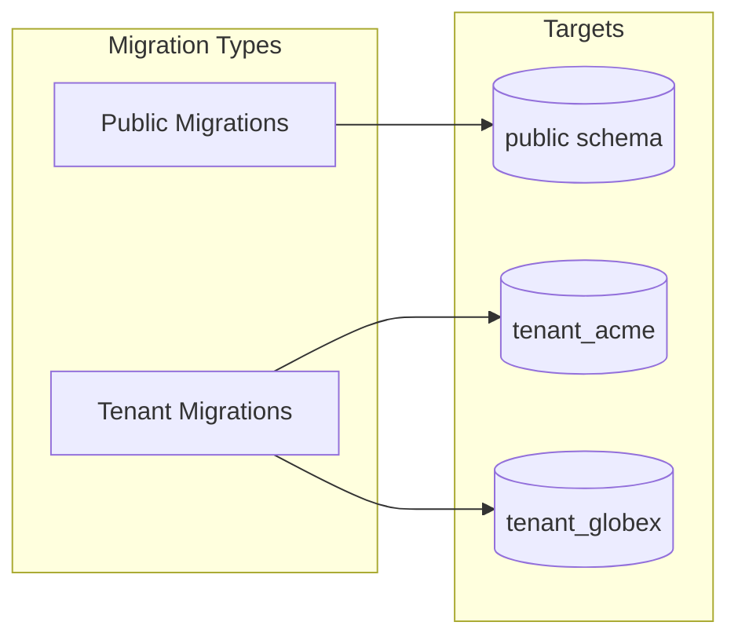

# Database Migrations

This document explains how Alembic is configured for multi-schema multi-tenant migrations.

## Overview

The migration system supports two distinct migration modes:

| Mode | Target | Command |
|------|--------|---------|
| **Public** | `public` schema only | `alembic upgrade head` |
| **Tenant** | Single tenant schema | `alembic upgrade head --tag=tenant_acme` |



## Alembic Configuration

### Environment Setup

```python
# src/alembic/env.py
from src.alembic.migration_utils import is_tenant_migration
from src.app.core.security.validators import validate_schema_name

def include_object(object, name, type_, reflected, compare_to):
    """Filter objects based on migration type (public vs tenant)."""
    is_tenant = is_tenant_migration()

    if type_ == "table":
        schema = getattr(object, "schema", None)
        if is_tenant:
            # Tenant migrations: exclude public schema tables
            return schema != "public"
        else:
            # Public migrations: only include public schema tables
            return schema == "public"

    return True


def do_run_migrations(connection: Connection) -> None:
    """Execute migrations with proper schema isolation."""
    schema = context.get_tag_argument()

    if schema:
        # TENANT MIGRATION
        validate_schema_name(schema)  # Defense in depth

        # Use quote_ident for safe SQL identifier
        result = connection.execute(
            text("SELECT quote_ident(:schema)"),
            {"schema": schema}
        )
        quoted_schema = result.scalar_one()

        # Create schema and set search_path
        connection.execute(text(f"CREATE SCHEMA IF NOT EXISTS {quoted_schema}"))
        connection.execute(text(f"SET search_path TO {quoted_schema}"))
    else:
        # PUBLIC MIGRATION
        connection.execute(text("SET search_path TO public"))

    context.configure(
        connection=connection,
        target_metadata=target_metadata,
        include_object=include_object,
        version_table_schema=schema if schema else "public",
        include_schemas=True,
        compare_type=True,
    )

    with context.begin_transaction():
        context.run_migrations()
```

### Migration Utils

```python
# src/alembic/migration_utils.py
from alembic import context

def is_tenant_migration() -> bool:
    """Check if this is a tenant-specific migration."""
    return bool(context.get_tag_argument())
```

## Writing Migrations

### Public Schema Migrations

Tables in the public schema need the `schema="public"` table argument:

```python
# src/alembic/versions/001_initial.py
from src.alembic.migration_utils import is_tenant_migration

revision = "001"
down_revision = None

def upgrade() -> None:
    if is_tenant_migration():
        return  # Skip for tenant migrations

    op.create_table(
        "tenants",
        sa.Column("id", sa.UUID(), nullable=False),
        sa.Column("name", sa.String(100), nullable=False),
        sa.Column("slug", sa.String(56), nullable=False),
        sa.Column("status", sa.String(20), nullable=False),
        sa.PrimaryKeyConstraint("id"),
        sa.UniqueConstraint("slug"),
        schema="public",  # Explicit schema
    )

def downgrade() -> None:
    if is_tenant_migration():
        return

    op.drop_table("tenants", schema="public")
```

### Tenant Schema Migrations

Tenant tables omit the schema argument (uses `search_path`):

```python
# src/alembic/versions/XXX_add_tenant_products.py
from src.alembic.migration_utils import is_tenant_migration

revision = "XXX"
down_revision = "YYY"

def upgrade() -> None:
    if not is_tenant_migration():
        return  # Skip for public migrations

    op.create_table(
        "products",
        sa.Column("id", sa.UUID(), nullable=False),
        sa.Column("name", sa.String(200), nullable=False),
        sa.Column("price", sa.Numeric(10, 2), nullable=False),
        sa.PrimaryKeyConstraint("id"),
        # No schema= argument - uses search_path
    )

def downgrade() -> None:
    if not is_tenant_migration():
        return

    op.drop_table("products")
```

### Migration Checklist

When writing migrations, ensure:

- [ ] Use `is_tenant_migration()` guard at start of `upgrade()` and `downgrade()`
- [ ] Public tables have `schema="public"` argument
- [ ] Tenant tables omit schema argument
- [ ] Indexes and constraints follow same schema rules
- [ ] Test both public and tenant migration paths

## Running Migrations

### Development

```bash
# Run public schema migrations
make migrate

# Run tenant schema migrations (for a specific tenant)
TENANT=acme make migrate-tenant

# Or directly with Alembic
alembic upgrade head                    # Public
alembic upgrade head --tag=tenant_acme  # Tenant
```

### Programmatic Execution

```python
# src/app/core/db/migrations.py
import subprocess

def run_migrations_sync(schema_name: str | None = None) -> None:
    """Run Alembic migrations synchronously."""
    cmd = ["alembic", "upgrade", "head"]

    if schema_name:
        validate_schema_name(schema_name)
        cmd.extend(["--tag", schema_name])

    result = subprocess.run(
        cmd,
        capture_output=True,
        text=True,
        check=True,
    )
```

### In Temporal Workflow

```python
# src/app/temporal/activities.py
@activity.defn
async def run_tenant_migrations(schema_name: str) -> None:
    """Activity to run migrations for a tenant schema."""
    validate_schema_name(schema_name)
    await asyncio.to_thread(run_migrations_sync, schema_name)
```

## Safety Mechanisms

### 1. Schema Name Validation

All schema names are validated before any SQL execution:

```python
def validate_schema_name(name: str) -> None:
    """Validate schema name is safe for SQL."""
    if len(name) > 63:
        raise ValueError("Schema name exceeds PostgreSQL limit")

    if not re.match(r"^tenant_[a-z][a-z0-9]*(_[a-z0-9]+)*$", name):
        raise ValueError("Invalid schema name format")

    forbidden = ["pg_", "information_schema", "--", ";", "/*"]
    for pattern in forbidden:
        if pattern in name.lower():
            raise ValueError(f"Forbidden pattern: {pattern}")
```

### 2. Quote Identifier

PostgreSQL's `quote_ident()` function properly escapes identifiers:

```python
# Safe identifier quoting
result = connection.execute(
    text("SELECT quote_ident(:schema)"),
    {"schema": schema_name}
)
quoted = result.scalar_one()  # e.g., "tenant_acme" or "tenant_special-name"
```

### 3. Include Object Filter

The `include_object` callback prevents cross-schema migrations:

```python
def include_object(object, name, type_, reflected, compare_to):
    is_tenant = is_tenant_migration()
    if type_ == "table":
        schema = getattr(object, "schema", None)
        if is_tenant:
            return schema != "public"  # Exclude public tables
        else:
            return schema == "public"  # Only public tables
    return True
```

### 4. Separate Version Tables

Each schema has its own `alembic_version` table:

```sql
-- Public schema
public.alembic_version

-- Tenant schemas
tenant_acme.alembic_version
tenant_globex.alembic_version
```

This allows independent migration tracking per schema.

## Production Considerations

### Migration Strategy

1. **Run public migrations first** - Updates shared schema
2. **Run tenant migrations per-tenant** - Either serially or in parallel

```bash
# Deploy script example
#!/bin/bash

# 1. Public migrations
alembic upgrade head

# 2. Tenant migrations (parallel with GNU parallel)
psql -t -c "SELECT slug FROM tenants WHERE status = 'ready'" | \
    parallel -j4 "alembic upgrade head --tag=tenant_{}"
```

### Handling Failures

If a tenant migration fails:

1. The tenant's schema may be in an inconsistent state
2. Check `tenant_xxx.alembic_version` for current revision
3. Fix the issue and retry
4. Consider marking tenant as `failed` until resolved

```sql
-- Check migration state
SELECT * FROM tenant_acme.alembic_version;

-- Manual rollback if needed
SET search_path TO tenant_acme;
-- Run compensating SQL
```

### Zero-Downtime Migrations

For zero-downtime deployments:

1. **Additive changes only** in forward migrations
2. **Blue-green deployment** with migration in between
3. **Feature flags** to control new functionality
4. **Backward-compatible schema changes**

```python
# Good: Additive change
op.add_column("users", sa.Column("new_field", sa.String(100), nullable=True))

# Bad: Breaking change
op.drop_column("users", "old_field")  # Apps still using this will break
```

## Generating New Migrations

```bash
# Auto-generate from model changes
alembic revision --autogenerate -m "Add products table"

# Create empty migration for manual SQL
alembic revision -m "Add custom index"
```

### Autogenerate Limitations

Alembic's autogenerate works with some caveats:

- Detects table/column additions and removals
- May not detect all constraint changes
- Review generated migrations before applying
- Test both upgrade and downgrade paths

## Migration File Naming

```
src/alembic/versions/
├── 001_initial.py
├── 003_add_performance_indexes.py
├── 004_add_email_verification.py
├── 005_add_refresh_tokens.py
├── 006_add_workflow_executions.py
├── ...
```

> **Note**: Migration numbers are revision identifiers, not necessarily sequential. The `down_revision` chain defines the order.

## Troubleshooting

### "relation already exists"

Schema exists but `alembic_version` is missing or incorrect:

```sql
-- Check current revision
SELECT * FROM tenant_acme.alembic_version;

-- Manually set revision if needed
INSERT INTO tenant_acme.alembic_version (version_num)
VALUES ('003');
```

### "permission denied for schema"

Migration user needs schema creation privileges:

```sql
GRANT CREATE ON DATABASE mydb TO migration_user;
```

### Slow Migrations

Large tables may need online schema changes:

```python
# Instead of:
op.add_column("large_table", sa.Column("new", sa.Integer()))

# Use:
op.execute("ALTER TABLE large_table ADD COLUMN new INTEGER")
# Add NOT NULL constraint separately after backfill
```

## Next Steps

- [Multi-Tenancy Guide](multi-tenancy.md) - Tenant lifecycle details
- [Security Guide](../security.md) - Security implementation
- [Deployment Guide](../production/deployment.md) - Production migrations
