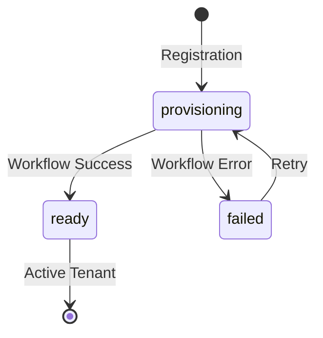
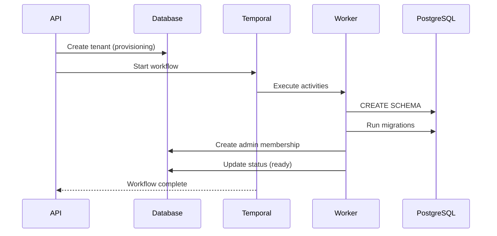

# Multi-Tenancy Deep Dive

This document explains the multi-tenancy implementation in detail, including tenant lifecycle, schema isolation, and security mechanisms.

## Tenant Lifecycle

### Status States

Tenants progress through defined states during their lifecycle:



| Status | Description |
|--------|-------------|
| `provisioning` | Tenant created, schema being prepared |
| `ready` | Schema created, migrations complete, fully operational |
| `failed` | Provisioning encountered an error |

### Tenant Model

```python
# src/app/models/public/tenant.py
class Tenant(SQLModel, table=True):
    __table_args__ = {"schema": "public"}

    id: UUID = Field(default_factory=uuid7, primary_key=True)
    name: str = Field(max_length=100, index=True)
    slug: str = Field(max_length=56, unique=True, index=True)
    status: str = Field(default=TenantStatus.PROVISIONING.value)
    is_active: bool = Field(default=True)
    created_at: datetime = Field(default_factory=utc_now)
    deleted_at: datetime | None = Field(default=None)

    @property
    def schema_name(self) -> str:
        """Returns validated schema name: tenant_{slug}"""
        name = f"{TENANT_SCHEMA_PREFIX}{self.slug}"
        validate_schema_name(name)
        return name

    @property
    def is_deleted(self) -> bool:
        return self.deleted_at is not None
```

### Slug Constraints

Tenant slugs have strict validation to ensure safe schema names:

| Constraint | Value | Reason |
|------------|-------|--------|
| Max length | 56 characters | PostgreSQL limit (63) - prefix length (7) |
| Format | `^[a-z][a-z0-9]*(_[a-z0-9]+)*$` | Valid SQL identifier |
| Prefix | `tenant_` | Schema namespace isolation |

```python
# src/app/core/security/validators.py
MAX_SCHEMA_LENGTH: Final[int] = 63  # PostgreSQL identifier limit
TENANT_SCHEMA_PREFIX: Final[str] = "tenant_"
MAX_TENANT_SLUG_LENGTH: Final[int] = MAX_SCHEMA_LENGTH - len(TENANT_SCHEMA_PREFIX)
TENANT_SLUG_REGEX: Final[str] = r"^[a-z][a-z0-9]*(_[a-z0-9]+)*$"
```

## Tenant Provisioning Workflow

### Overview

Tenant provisioning uses Temporal.io for durable, fault-tolerant execution:



### Workflow Implementation

```python
# src/app/temporal/workflows.py
@workflow.defn
class TenantProvisioningWorkflow:
    """Orchestrates tenant schema creation with Saga-pattern compensation."""

    @workflow.run
    async def run(self, input: TenantProvisioningInput) -> TenantProvisioningOutput:
        compensations: list[CompensationAction] = []

        try:
            # Step 1: Get tenant info
            tenant_info = await workflow.execute_activity(
                get_tenant_info,
                args=[input.tenant_id],
                start_to_close_timeout=timedelta(seconds=30),
            )

            # Step 2: Run migrations (creates schema)
            await workflow.execute_activity(
                run_tenant_migrations,
                args=[tenant_info.schema_name],
                start_to_close_timeout=timedelta(minutes=5),
            )
            # Register compensation in case later steps fail
            compensations.append(CompensationAction(
                activity=drop_tenant_schema,
                args=[tenant_info.schema_name],
            ))

            # Step 3: Create admin membership
            await workflow.execute_activity(
                create_admin_membership,
                args=[input.tenant_id, input.admin_user_id],
                start_to_close_timeout=timedelta(seconds=30),
            )

            # Step 4: Mark tenant as ready
            await workflow.execute_activity(
                update_tenant_status,
                args=[input.tenant_id, TenantStatus.READY.value],
                start_to_close_timeout=timedelta(seconds=30),
            )

            return TenantProvisioningOutput(success=True)

        except Exception as e:
            # Run compensations in reverse order
            await self._run_compensations(compensations)

            # Mark tenant as failed
            await workflow.execute_activity(
                update_tenant_status,
                args=[input.tenant_id, TenantStatus.FAILED.value],
                start_to_close_timeout=timedelta(seconds=30),
            )

            raise
```

### Activities

Activities are the individual steps executed by the worker:

```python
# src/app/temporal/activities.py

@activity.defn
async def run_tenant_migrations(schema_name: str) -> None:
    """Run Alembic migrations for a tenant schema."""
    validate_schema_name(schema_name)  # Defense in depth
    await asyncio.to_thread(run_migrations_sync, schema_name)

@activity.defn
async def drop_tenant_schema(schema_name: str) -> None:
    """Compensation: Drop schema on failure."""
    validate_schema_name(schema_name)
    async with get_session() as session:
        await session.execute(
            text(f"DROP SCHEMA IF EXISTS {quote_ident(schema_name)} CASCADE")
        )
        await session.commit()
```

## Schema Isolation

### Search Path Management

When accessing tenant data, the connection's `search_path` is set to the tenant schema:

```python
# src/app/core/db/session.py
@asynccontextmanager
async def get_tenant_session(schema_name: str) -> AsyncGenerator[AsyncSession, None]:
    """Get a session scoped to a tenant schema."""
    validate_schema_name(schema_name)

    async with async_session_maker() as session:
        try:
            # Set search_path to ONLY the tenant schema
            await session.execute(
                text(f"SET search_path TO {quote_ident(schema_name)}")
            )
            yield session
        finally:
            # Always reset to public (connection pooling safety)
            await session.execute(text("SET search_path TO public"))
```

> **Warning**: The `search_path` is set to ONLY the tenant schema, not `tenant_schema, public`. This ensures queries cannot accidentally access other schemas.

### Statement Cache Disabled

The statement cache is disabled to prevent cross-tenant data leakage:

```python
# src/app/core/db/engine.py
engine = create_async_engine(
    settings.database_url,
    connect_args={
        "statement_cache_size": 0,  # CRITICAL for multi-tenancy
    },
)
```

**Why?** PostgreSQL's prepared statements include the `search_path` at preparation time. With connection pooling, a cached statement from `tenant_a` could execute against `tenant_b` if they reuse the same connection.

## Security Model

### Schema Name Validation

Multiple layers protect against SQL injection in schema names:

```python
# src/app/core/security/validators.py
FORBIDDEN_SCHEMA_PATTERNS = frozenset([
    "pg_",              # PostgreSQL system schemas
    "information_schema",
    "public",           # Prevent public schema override
    "--",               # SQL comment
    ";",                # Statement terminator
    "/*", "*/",         # Block comments
])

def validate_schema_name(name: str) -> None:
    """Validate schema name is safe for SQL use."""
    # Length check
    if len(name) > MAX_SCHEMA_LENGTH:
        raise ValueError(
            f"Schema name '{name}' exceeds PostgreSQL limit of {MAX_SCHEMA_LENGTH}"
        )

    # Format check (lowercase alphanumeric + underscore)
    if not _SCHEMA_PATTERN.match(name):
        raise ValueError(f"Invalid schema name format: {name}")

    # Forbidden patterns check
    name_lower = name.lower()
    for pattern in FORBIDDEN_SCHEMA_PATTERNS:
        if pattern in name_lower:
            raise ValueError(f"Schema name contains forbidden pattern: {pattern}")
```

### Quote Identifier

Even with validation, identifiers are quoted using PostgreSQL's `quote_ident()`:

```python
# In Alembic env.py
async with engine.connect() as conn:
    # Use quote_ident for safe identifier quoting
    result = await conn.execute(
        text("SELECT quote_ident(:schema)"),
        {"schema": schema_name}
    )
    quoted_schema = result.scalar_one()

    # Safe to use in DDL
    await conn.execute(text(f"CREATE SCHEMA IF NOT EXISTS {quoted_schema}"))
    await conn.execute(text(f"SET search_path TO {quoted_schema}"))
```

### Include Object Filter

Alembic's `include_object` function ensures migrations only affect the correct schema:

```python
# src/alembic/env.py
def include_object(object, name, type_, reflected, compare_to):
    """Filter objects based on migration type."""
    is_tenant_migration = context.get_tag_argument() is not None

    if type_ == "table":
        schema = getattr(object, "schema", None)
        if is_tenant_migration:
            # Tenant migrations: exclude public schema tables
            return schema != "public"
        else:
            # Public migrations: only include public schema tables
            return schema == "public"

    return True
```

## User-Tenant Relationships

### Membership Model

Users can belong to multiple tenants with different roles:

```python
# src/app/models/public/user.py
class UserTenantMembership(SQLModel, table=True):
    __table_args__ = {"schema": "public"}

    user_id: UUID = Field(foreign_key="public.users.id", primary_key=True)
    tenant_id: UUID = Field(foreign_key="public.tenants.id", primary_key=True)
    role: str = Field(default=MembershipRole.MEMBER.value)
    is_active: bool = Field(default=True)
    created_at: datetime = Field(default_factory=utc_now)
```

### Roles

| Role | Permissions |
|------|-------------|
| `admin` | Full access, can invite users, manage tenant |
| `member` | Standard access to tenant resources |

### Membership Validation

Every authenticated request validates the user's membership:

```python
# src/app/api/dependencies/auth.py
async def get_current_user(
    session: DBSession,
    tenant: ValidatedTenant,
    authorization: str | None,
) -> User:
    # ... JWT validation ...

    # CRITICAL: Verify user belongs to requested tenant
    membership = await session.execute(
        select(UserTenantMembership).where(
            UserTenantMembership.user_id == user.id,
            UserTenantMembership.tenant_id == tenant.id,
            UserTenantMembership.is_active == True,
        )
    )
    if not membership.scalar_one_or_none():
        raise HTTPException(403, "User not a member of this tenant")

    return user
```

## Handling Failed Provisioning

### Automatic Compensation

The workflow implements the Saga pattern - if any step fails, previous steps are compensated:

```python
async def _run_compensations(self, compensations: list[CompensationAction]) -> None:
    """Run compensation activities in reverse order."""
    for action in reversed(compensations):
        try:
            await workflow.execute_activity(
                action.activity,
                args=action.args,
                start_to_close_timeout=timedelta(seconds=60),
            )
        except Exception as e:
            # Log but continue - best effort cleanup
            workflow.logger.error(f"Compensation failed: {e}")
```

### Retry Strategy

Failed tenants can be retried:

```python
# Retry provisioning for a failed tenant
await tenant_service.retry_provisioning(tenant_id)
```

### Cleanup

For tenants that cannot be provisioned, manual cleanup may be needed:

```sql
-- Check failed tenants
SELECT id, slug, status, created_at
FROM public.tenants
WHERE status = 'failed';

-- Drop orphaned schema if exists
DROP SCHEMA IF EXISTS tenant_failed_slug CASCADE;

-- Delete tenant record
DELETE FROM public.tenants WHERE slug = 'failed_slug';
```

## Tenant Validation Dependency

The tenant validation dependency ensures only ready tenants can be accessed:

```python
# src/app/api/dependencies/tenant.py
async def get_validated_tenant(
    tenant_slug: str = Header(alias="X-Tenant-ID"),
    session: DBSession,
) -> Tenant:
    """Validate tenant exists and is ready for use."""
    result = await session.execute(
        select(Tenant).where(Tenant.slug == tenant_slug)
    )
    tenant = result.scalar_one_or_none()

    if not tenant:
        raise HTTPException(404, f"Tenant '{tenant_slug}' not found")

    if tenant.is_deleted:
        raise HTTPException(410, f"Tenant '{tenant_slug}' has been deleted")

    if not tenant.is_active:
        raise HTTPException(403, f"Tenant '{tenant_slug}' is inactive")

    if tenant.status == TenantStatus.PROVISIONING.value:
        raise HTTPException(503, f"Tenant '{tenant_slug}' is still provisioning")

    if tenant.status == TenantStatus.FAILED.value:
        raise HTTPException(503, f"Tenant '{tenant_slug}' failed to provision")

    return tenant
```

## Next Steps

- [Database Migrations](database-migrations.md) - Multi-schema migration details
- [Security Guide](../security.md) - Complete security documentation
- [Deployment Guide](../production/deployment.md) - Production considerations
