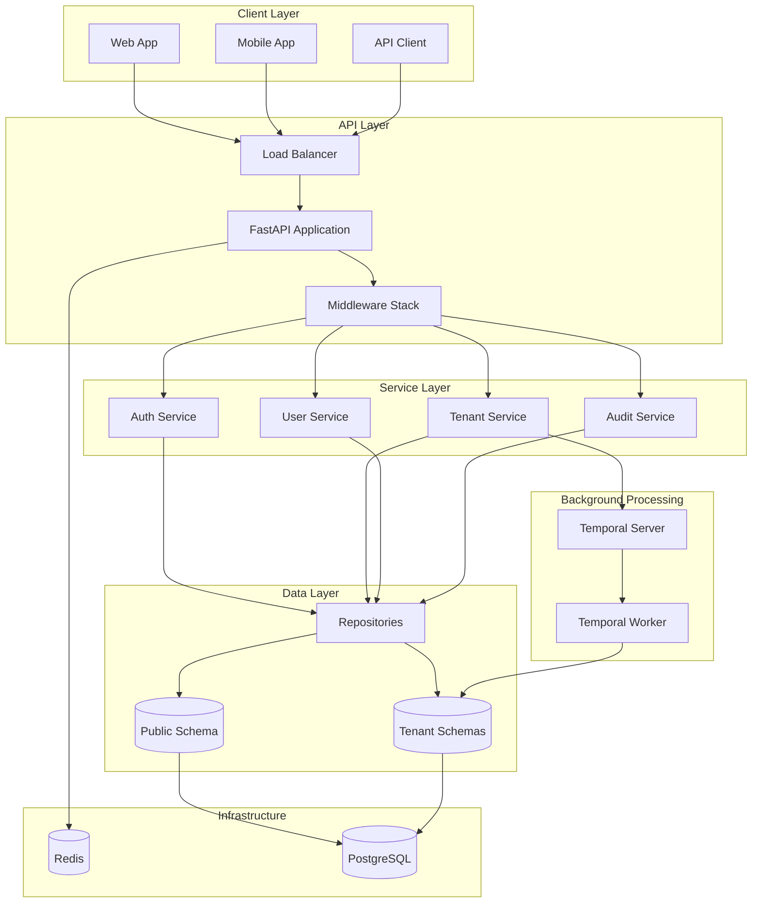
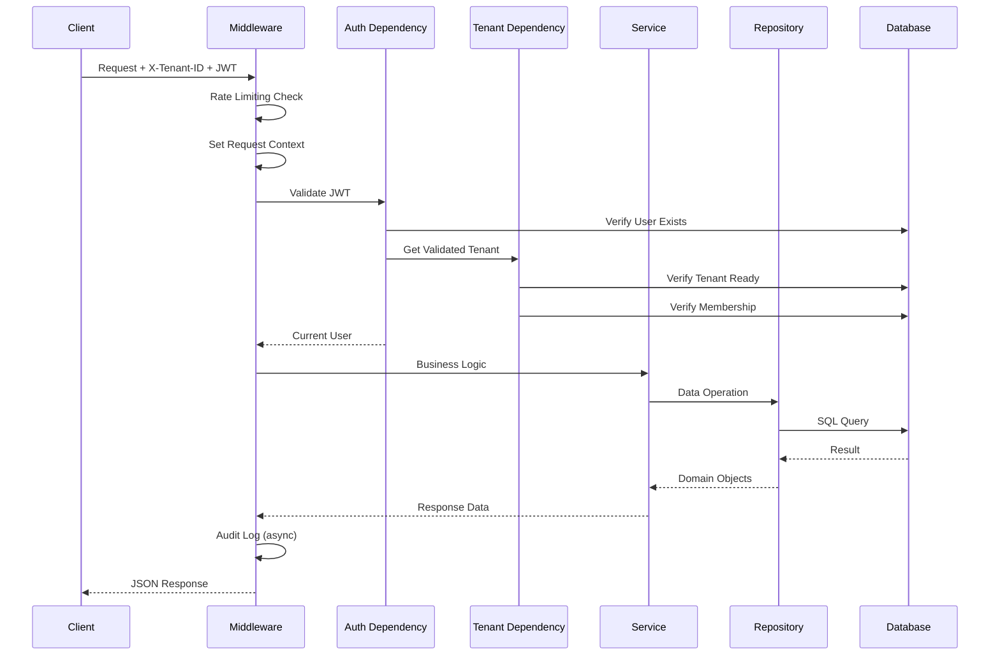

# System Architecture

This document provides a comprehensive overview of the FastAPI Multi-Tenant SaaS Starter architecture.

## High-Level Architecture



## The Lobby Pattern

This starter implements the **Lobby Pattern** (also known as "Hub and Spoke") for multi-tenancy:

### Public Schema (The Lobby)

The `public` schema contains shared, cross-tenant data:

| Table | Purpose |
|-------|---------|
| `tenants` | Tenant registry with status, slug, metadata |
| `users` | Centralized user accounts |
| `user_tenant_membership` | User-tenant relationships with roles |
| `refresh_tokens` | JWT refresh tokens (tenant-scoped) |
| `email_verifications` | Email verification tokens |
| `tenant_invites` | Pending invitations |
| `workflow_executions` | Background job tracking |
| `audit_logs` | System-wide audit trail |

### Tenant Schemas (The Spokes)

Each tenant gets a dedicated PostgreSQL schema:

- Named `tenant_{slug}` (e.g., `tenant_acme`, `tenant_globex`)
- Contains tenant-specific business data
- Completely isolated from other tenants
- Migrations run per-schema with proper isolation

```sql
-- Schema structure
public
  ├── tenants
  ├── users
  ├── user_tenant_membership
  └── ...

tenant_acme
  └── (tenant-specific tables)

tenant_globex
  └── (tenant-specific tables)
```

## Request Lifecycle



### Middleware Stack

Requests pass through these middleware layers in order:

1. **CORS Middleware** - Cross-origin request handling
2. **Security Headers** - CSP, HSTS, X-Frame-Options
3. **Request Tracking** - Correlation ID, graceful shutdown
4. **Logging Context** - Structured logging setup
5. **Request Context** - Audit context initialization
6. **Rate Limiting** - Global DoS protection

## Directory Structure

```
src/
├── app/
│   ├── api/                    # HTTP layer
│   │   ├── context/            # Request-scoped context
│   │   │   ├── audit_context.py
│   │   │   └── assumed_identity_context.py
│   │   ├── dependencies/       # FastAPI DI
│   │   │   ├── auth.py         # Authentication
│   │   │   ├── tenant.py       # Tenant validation
│   │   │   ├── db.py           # Database sessions
│   │   │   ├── services.py     # Service factories
│   │   │   └── repositories.py # Repository factories
│   │   ├── middlewares/        # ASGI middleware
│   │   └── v1/                 # API v1 routes
│   │
│   ├── core/                   # Configuration & utilities
│   │   ├── config.py           # Settings management
│   │   ├── db/                 # Database utilities
│   │   │   ├── engine.py       # Async engine
│   │   │   ├── session.py      # Session management
│   │   │   └── migrations.py   # Migration runner
│   │   ├── security/           # Security utilities
│   │   │   ├── crypto.py       # JWT, hashing
│   │   │   └── validators.py   # Input validation
│   │   ├── rate_limit.py       # Rate limiting
│   │   ├── redis.py            # Redis client
│   │   └── shutdown.py         # Graceful shutdown
│   │
│   ├── models/                 # SQLModel definitions
│   │   ├── base.py             # Base utilities
│   │   ├── enums.py            # Status enums
│   │   ├── public/             # Public schema models
│   │   └── tenant/             # Tenant schema models
│   │
│   ├── schemas/                # Pydantic DTOs
│   │   ├── auth.py             # Auth request/response
│   │   ├── user.py             # User DTOs
│   │   ├── tenant.py           # Tenant DTOs
│   │   └── ...
│   │
│   ├── repositories/           # Data access layer
│   │   ├── base.py             # Base repository
│   │   ├── public/             # Public schema repos
│   │   └── tenant/             # Tenant schema repos
│   │
│   ├── services/               # Business logic
│   │   ├── auth_service.py
│   │   ├── user_service.py
│   │   ├── tenant_service.py
│   │   └── ...
│   │
│   ├── temporal/               # Background workflows
│   │   ├── workflows.py        # Workflow definitions
│   │   ├── activities.py       # Activity implementations
│   │   ├── client.py           # Temporal client
│   │   └── worker.py           # Worker process
│   │
│   └── main.py                 # Application factory
│
├── alembic/                    # Database migrations
│   ├── env.py                  # Migration environment
│   ├── migration_utils.py      # Helper functions
│   └── versions/               # Migration files
│
└── main.py                     # Entry point
```

## Layered Architecture

### API Layer (`src/app/api/`)

Handles HTTP concerns:

- Request parsing and validation
- Response serialization
- Authentication and authorization
- Rate limiting
- Request context management

```python
# Example endpoint
@router.post("/users", response_model=UserRead)
async def create_user(
    data: UserCreate,
    current_user: AdminUser,  # Requires admin role
    user_service: UserServiceDep,
) -> UserRead:
    return await user_service.create_user(data)
```

### Service Layer (`src/app/services/`)

Contains business logic:

- Orchestrates operations across repositories
- Enforces business rules
- Handles transactions
- Triggers background jobs

```python
# Example service
class UserService:
    def __init__(self, user_repo: UserRepository, audit_service: AuditService):
        self.user_repo = user_repo
        self.audit_service = audit_service

    async def create_user(self, data: UserCreate) -> User:
        user = await self.user_repo.create(data)
        await self.audit_service.log(AuditAction.USER_CREATE, user.id)
        return user
```

### Repository Layer (`src/app/repositories/`)

Data access abstraction:

- CRUD operations
- Query building
- Database interaction
- No business logic

```python
# Example repository
class UserRepository(BaseRepository[User]):
    async def get_by_email(self, email: str) -> User | None:
        result = await self.session.execute(
            select(User).where(User.email == email)
        )
        return result.scalar_one_or_none()
```

### Model Layer (`src/app/models/`)

Domain entities:

- SQLModel table definitions
- Relationships
- Properties and computed fields
- Validation at persistence level

## Dependency Injection

FastAPI's dependency injection system provides:

```python
# Type aliases for clean signatures
DBSession = Annotated[AsyncSession, Depends(get_db_session)]
CurrentUser = Annotated[User, Depends(get_current_user)]
ValidatedTenant = Annotated[Tenant, Depends(get_validated_tenant)]

# Service dependencies
UserServiceDep = Annotated[UserService, Depends(get_user_service)]

# Usage in endpoints
@router.get("/me")
async def get_current_user_profile(
    current_user: CurrentUser,
    tenant: ValidatedTenant,
) -> UserRead:
    return current_user
```

## Database Connection Management

### Engine Configuration

```python
# Async engine with proper pooling
engine = create_async_engine(
    settings.database_url,
    pool_size=5,
    max_overflow=10,
    pool_pre_ping=True,
    # CRITICAL: Disable statement cache for multi-tenant safety
    connect_args={"statement_cache_size": 0}
)
```

### Session Management

Two session types are available:

1. **Public Session** - For public schema operations
2. **Tenant Session** - Sets `search_path` to tenant schema

```python
# Public schema operations
async with get_session() as session:
    users = await session.execute(select(User))

# Tenant schema operations
async with get_tenant_session("tenant_acme") as session:
    # search_path automatically set to tenant_acme
    data = await session.execute(select(TenantData))
```

## Error Handling

Consistent error responses across the API:

```python
class APIException(HTTPException):
    """Base exception with structured error response."""
    pass

# Specific exceptions
class TenantNotFoundError(APIException):
    def __init__(self, slug: str):
        super().__init__(status_code=404, detail=f"Tenant '{slug}' not found")

class TenantNotReadyError(APIException):
    def __init__(self, slug: str):
        super().__init__(status_code=503, detail=f"Tenant '{slug}' is provisioning")
```

## Configuration Management

Environment-based configuration with validation:

```python
class Settings(BaseSettings):
    # Required
    database_url: str
    jwt_secret_key: str = Field(min_length=32)

    # Optional with defaults
    debug: bool = False
    access_token_expire_minutes: int = 30
    global_rate_limit_per_second: int = 10

    model_config = SettingsConfigDict(
        env_file=".env",
        env_file_encoding="utf-8",
    )
```

## Next Steps

- [Multi-Tenancy Deep Dive](multi-tenancy.md) - Detailed tenant lifecycle
- [Database Migrations](database-migrations.md) - Multi-schema migration system
- [Security Guide](../security.md) - Security implementation details
