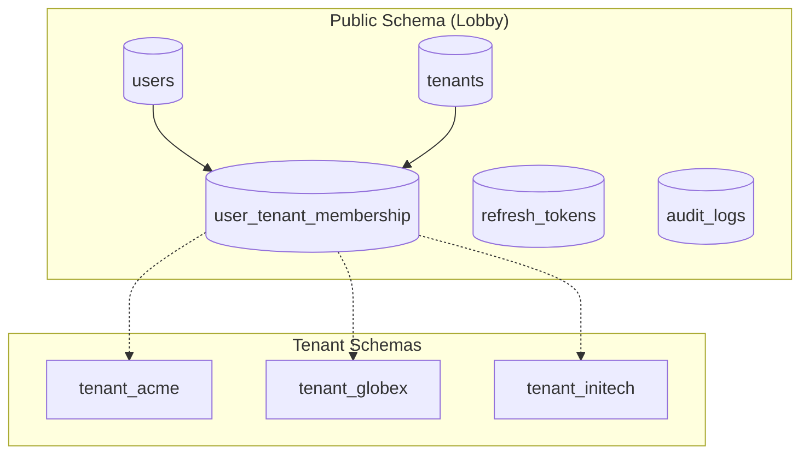
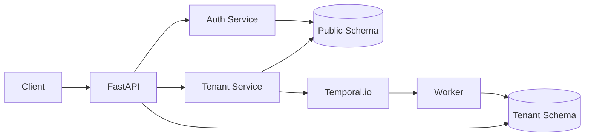

# FastAPI Multi-Tenant SaaS Starter

A production-ready, enterprise-grade FastAPI starter kit for building secure multi-tenant SaaS applications using PostgreSQL's schema-per-tenant isolation pattern.

## Overview

This starter kit provides a complete foundation for building multi-tenant SaaS applications with:

- **Schema-per-tenant isolation** - Each tenant gets a dedicated PostgreSQL schema
- **Centralized authentication** - Users managed in a shared "lobby" with tenant memberships
- **Durable background workflows** - Temporal.io for reliable tenant provisioning
- **Comprehensive security** - SQL injection prevention, rate limiting, audit logging
- **Modern Python stack** - FastAPI, SQLModel, asyncpg, uv package manager



## Key Features

| Feature | Description |
|---------|-------------|
| **Multi-Tenancy** | Schema-per-tenant with PostgreSQL for complete data isolation |
| **Authentication** | JWT access/refresh tokens with tenant scoping |
| **Authorization** | Role-based access (admin/member) per tenant |
| **Provisioning** | Temporal workflows for durable tenant creation |
| **Security** | Argon2id passwords, zxcvbn validation, rate limiting |
| **Audit Logging** | Comprehensive action tracking with request context |
| **Email Verification** | Secure token-based email confirmation |
| **Tenant Invites** | Invite users to join tenants with role assignment |
| **Assumed Identity** | Superuser impersonation for support scenarios |
| **Graceful Shutdown** | Request draining and proper cleanup |

## When to Use This Starter

### Use Schema-per-Tenant When:

- **Strong data isolation is required** - Compliance, regulatory requirements (HIPAA, SOC2)
- **Tenants may have different schemas** - Custom fields, tenant-specific tables
- **Per-tenant backup/restore is needed** - Independent tenant data management
- **Cross-tenant queries are rare** - Most operations are single-tenant
- **Tenant count is moderate** - Hundreds to low thousands of tenants

### Consider Row-Level Security (RLS) When:

- **High tenant count expected** - Tens of thousands or more tenants
- **Schema is uniform** - All tenants have identical data structures
- **Cross-tenant queries are common** - Analytics, reporting across tenants
- **Simpler migration management** - Single schema to maintain
- **Lower operational overhead** - No schema provisioning workflow

## Architecture at a Glance



**Request Flow:**

1. Client sends request with `X-Tenant-Slug` header and JWT token
2. FastAPI validates tenant exists and is ready
3. Auth dependency verifies JWT and tenant membership
4. Service layer executes business logic
5. Repository layer accesses appropriate schema (public or tenant)
6. Response returned with proper security headers

## Quick Start

Get up and running in 5 minutes:

```bash
# Clone the repository
git clone https://github.com/your-org/fastapi-starter.git
cd fastapi-starter

# Start all services
make docker-up

# Open Swagger UI
open http://localhost:8000/docs
```

Register your first user and tenant:

```bash
curl -X POST http://localhost:8000/api/v1/auth/register \
  -H "Content-Type: application/json" \
  -d '{
    "email": "admin@example.com",
    "password": "SecureP@ssw0rd!2024",
    "full_name": "Admin User",
    "tenant_name": "Acme Corporation",
    "tenant_slug": "acme"
  }'
```

See the [Getting Started Guide](getting-started.md) for detailed setup instructions.

## Documentation

- **[Getting Started](getting-started.md)** - Installation, setup, and first steps
- **Architecture**
  - [System Overview](architecture/overview.md) - High-level architecture
  - [Multi-Tenancy](architecture/multi-tenancy.md) - Tenant lifecycle and isolation
  - [Database Migrations](architecture/database-migrations.md) - Alembic configuration
- **[Security](security.md)** - Authentication, authorization, and security features
- **Development**
  - [Testing](development/testing.md) - Test structure and running tests
- **Production**
  - [Deployment](production/deployment.md) - Production deployment guide
- **[Contributing](contributing.md)** - How to contribute

## Tech Stack

| Component | Technology |
|-----------|------------|
| Web Framework | FastAPI 0.115+ |
| ORM | SQLModel (SQLAlchemy + Pydantic) |
| Database | PostgreSQL 16+ |
| Async Driver | asyncpg |
| Migrations | Alembic |
| Background Jobs | Temporal.io |
| Password Hashing | Argon2id |
| Rate Limiting | slowapi + Redis |
| Logging | structlog |
| Package Manager | uv |

## Project Status

This is a **production-ready starter template** designed to be forked and customized for your specific SaaS requirements. It includes:

- Comprehensive security measures
- Full test coverage for critical paths
- Docker Compose development environment
- CI/CD-ready configuration

## License

MIT License - See [LICENSE](../LICENSE) for details.
